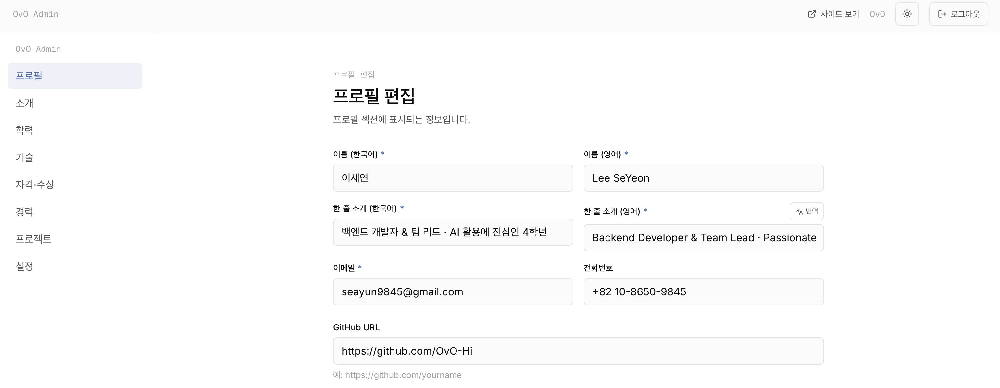
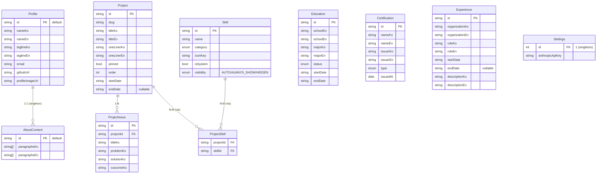

# OvO-Portfolio

> 개발자 자기소개·이력서를 다루는 1인용 포트폴리오 사이트.
> 한국어/영어 동시 운영, 어드민 페이지로 컨텐츠 관리, AI 기반 자동 번역, PDF 이력서 다운로드 지원.

**Live demo:** [ovo-portfolio.vercel.app](https://ovo-portfolio.vercel.app)

---

## 미리보기


| 어드민 폼 | PDF 이력서 |
| --- | --- |
|  |  |

---

## 주요 기능

- **이중 언어** — 한국어/영어 콘텐츠를 한 row에 나란히 저장하고, `/ko`·`/en` 라우트로 분기.
- **다크/라이트 테마** — `next-themes` 기반 토글, 시스템 설정 자동 감지.
- **어드민 CRUD** — 프로필·소개·학력·기술·자격·경력·프로젝트를 모두 어드민 페이지에서 직접 편집. GitHub OAuth + 이메일 화이트리스트로 본인만 접근.
- **숨김 진입점** — 푸터 더블클릭 또는 `Cmd/Ctrl + Shift + A` 단축키로 어드민 진입. 메인 화면에는 노출되지 않음.
- **AI 자동 번역** — 한국어 입력 후 영문 칸 옆 "번역" 버튼 한 번으로 영어 변환. 기존 영문이 있으면 [참고해서 번역 / 덮어쓰기 / 취소] 모달 분기. Claude Haiku 4.5 사용.
- **이미지 업로드** — Vercel Blob 기반, 드래그앤드롭 + 클릭 + 키보드 모두 지원. 프로필은 원형, 프로젝트 썸네일은 16:9.
- **프로젝트 정렬** — `@dnd-kit` 드래그앤드롭으로 순서 변경 + 핀 기능.
- **PDF 이력서 다운로드** — `@react-pdf/renderer`로 A4 한 장짜리 이력서 동적 생성. Pretendard 한글 폰트 임베딩.
- **YouTube 임베드** — 일반/단축/쇼츠 URL 모두 지원. 쇼츠는 9:16 세로 비율로 자동 렌더.
- **스킬 가시화 시스템** — 프로젝트에 연결된 스킬은 자동 표시, 강제 표시/숨김도 개별 토글 가능.

---

## 기술 스택

**프론트엔드**

| 분류 | 기술 |
| --- | --- |
| 프레임워크 | Next.js 14 (App Router) |
| 언어 | TypeScript |
| 스타일링 | Tailwind CSS |
| 국제화 | next-intl |
| 테마 | next-themes |
| 상호작용 | @dnd-kit, react-markdown, lucide-react |

**백엔드**

| 분류 | 기술 |
| --- | --- |
| 런타임 | Next.js API Routes / Server Actions |
| ORM | Prisma |
| DB | PostgreSQL (Neon) |
| 인증 | NextAuth v5 + GitHub OAuth |
| 파일 저장 | Vercel Blob |
| AI | Anthropic Claude (Haiku 4.5) |
| PDF | @react-pdf/renderer |

**배포**

- Vercel (자동 배포 + Edge Network)
- Neon Serverless Postgres

---

## 로컬 실행 방법

### 사전 준비

- Node.js 20+ / npm
- PostgreSQL 데이터베이스 (Neon 추천 — 무료 티어 + 서버리스)
- GitHub OAuth App (어드민 로그인용)
- Anthropic API 키 (자동 번역용 — 선택)
- Vercel Blob 토큰 (이미지 업로드용 — 선택)

### 설치

```bash
git clone https://github.com/OvO-Hi/OvO-Portfolio.git
cd OvO-Portfolio/ovo-portfolio
npm install
```

### 환경변수

`ovo-portfolio/.env` 파일을 만들고 다음 값을 채운다:

```env
# Database (Neon Postgres)
DATABASE_URL="postgres://..."

# NextAuth
AUTH_SECRET="..."   # `openssl rand -base64 32`로 생성
AUTH_TRUST_HOST=true

# GitHub OAuth (https://github.com/settings/developers 에서 생성)
GITHUB_ID="..."
GITHUB_SECRET="..."

# 어드민 접근 허용 이메일 (콤마로 구분)
ADMIN_EMAILS="your-email@example.com"

# Vercel Blob (선택, 이미지 업로드 사용 시)
BLOB_READ_WRITE_TOKEN="..."

# 사이트 URL (배포 환경에서만)
NEXT_PUBLIC_SITE_URL="https://your-domain.vercel.app"
```

### DB 마이그레이션 + 시드

```bash
npx prisma migrate dev
npx prisma db seed
```

### 개발 서버 실행

```bash
npm run dev
```

`http://localhost:3000` 접속.

### 어드민 진입

1. 메인 페이지 푸터 더블클릭 또는 `Cmd/Ctrl + Shift + A`
2. GitHub 로그인 (위에서 `ADMIN_EMAILS`에 등록한 계정으로)
3. `/admin/settings`에서 Anthropic API 키 입력 (자동 번역 사용 시)

---

## 프로젝트 구조

```
OvO-Portfolio/
├── ovo-portfolio/              # Next.js 앱
│   ├── prisma/
│   │   ├── schema.prisma       # DB 스키마
│   │   └── seed.ts             # 초기 데이터
│   ├── src/
│   │   ├── app/
│   │   │   ├── [locale]/       # 메인 사이트 (ko/en)
│   │   │   ├── admin/          # 어드민 페이지
│   │   │   │   └── (dashboard)/
│   │   │   │       ├── profile/
│   │   │   │       ├── about/
│   │   │   │       ├── education/
│   │   │   │       ├── skills/
│   │   │   │       ├── certifications/
│   │   │   │       ├── experience/
│   │   │   │       ├── projects/
│   │   │   │       ├── settings/
│   │   │   │       └── translate/
│   │   │   └── api/
│   │   ├── components/
│   │   │   ├── sections/       # 메인 사이트 섹션 (Hero, About, ...)
│   │   │   ├── admin/          # 어드민 공용 컴포넌트
│   │   │   └── ui/             # 디자인 시스템
│   │   ├── lib/
│   │   │   ├── prisma.ts       # Prisma client
│   │   │   ├── queries.ts      # 메인 사이트 데이터 페치
│   │   │   ├── admin-queries.ts
│   │   │   ├── translate.ts    # Anthropic API 호출
│   │   │   ├── youtube.ts      # YouTube URL 파서
│   │   │   ├── blob.ts         # 이미지 업로드 헬퍼
│   │   │   └── pdf/            # PDF 이력서 생성
│   │   ├── messages/           # i18n 텍스트 (ko.json, en.json)
│   │   └── types/
│   └── public/
├── assets/                     # README 미리보기 이미지
├── README.md
└── ...
```

---

## DB 스키마

총 9개 모델 + 1개 싱글톤 설정 테이블.



---

## 배포 (Vercel)

1. 이 저장소를 Fork 또는 Clone.
2. [Vercel](https://vercel.com/) 에 GitHub 연동, **Root Directory를 `ovo-portfolio/` 로 설정**.
3. Vercel 프로젝트 환경변수에 위 `.env` 항목 모두 추가.
4. `package.json`의 `build` 스크립트가 `prisma migrate deploy && next build`로 설정되어 있어 배포 시 마이그레이션이 자동 적용됨.
5. GitHub OAuth App의 Authorization callback URL을 프로덕션 도메인으로 수정 (`https://your-domain.vercel.app/api/auth/callback/github`).

---

## 관련 글

만들면서 적은 개발 일지:

1. [OvO-Portfolio #1 — 개발자답게 CV 사이트 만들어보기 — 기획편](https://velog.io/@your-handle/post-1)
2. [OvO-Portfolio #2 — PDF 이력서 다운로드 만들다가 새벽 4시까지 한글 폰트랑 싸운 썰](https://velog.io/@your-handle/post-2)
3. [OvO-Portfolio #3 — 처음 계획이랑 비교해보는 최종 회고편](https://velog.io/@your-handle/post-3)

---

## 만든 사람

**이세연** ([@OvO-Hi](https://github.com/OvO-Hi))
seayun9845@gmail.com

---
---

# OvO-Portfolio (English)

> A personal portfolio website for showcasing developer profiles and résumés.
> Bilingual (Korean/English), full content management via admin panel, AI-powered auto-translation, and PDF résumé download.

**Live demo:** [ovo-portfolio.vercel.app](https://ovo-portfolio.vercel.app)

---

## Preview


| Admin form | PDF résumé |
| --- | --- |
|  |  |

---

## Features

- **Bilingual content** — Korean and English stored side-by-side per record, served via `/ko` and `/en` routes.
- **Dark/light themes** — `next-themes`-based toggle, with system preference detection.
- **Full admin CRUD** — Edit profile, about, education, skills, certifications, experience, and projects directly from the admin panel. Access controlled via GitHub OAuth + email allowlist.
- **Hidden admin entrypoint** — Double-click footer or `Cmd/Ctrl + Shift + A` shortcut. Not exposed on the main UI.
- **AI auto-translation** — One-click translation of Korean to English next to each English field. When existing English content is present, a modal offers [Translate referencing existing / Overwrite / Cancel]. Powered by Claude Haiku 4.5.
- **Image uploads** — Vercel Blob-backed, with drag-and-drop, click, and keyboard support. Circular avatars and 16:9 project thumbnails.
- **Project ordering** — `@dnd-kit` drag-and-drop reordering with pin support.
- **PDF résumé download** — Single-page A4 résumé generated on the fly via `@react-pdf/renderer`, with Pretendard Korean font embedded.
- **YouTube embed** — Supports standard, short, and Shorts URLs. Shorts are rendered in 9:16 portrait.
- **Skill visibility system** — Skills auto-surface when linked to a project, with per-skill manual overrides (always show / hidden).

---

## Tech Stack

**Frontend**

| Category | Tech |
| --- | --- |
| Framework | Next.js 14 (App Router) |
| Language | TypeScript |
| Styling | Tailwind CSS |
| i18n | next-intl |
| Theme | next-themes |
| Interaction | @dnd-kit, react-markdown, lucide-react |

**Backend**

| Category | Tech |
| --- | --- |
| Runtime | Next.js API Routes / Server Actions |
| ORM | Prisma |
| DB | PostgreSQL (Neon) |
| Auth | NextAuth v5 + GitHub OAuth |
| File storage | Vercel Blob |
| AI | Anthropic Claude (Haiku 4.5) |
| PDF | @react-pdf/renderer |

**Deployment**

- Vercel (automatic deploys + Edge Network)
- Neon Serverless Postgres

---

## Getting Started

### Prerequisites

- Node.js 20+ and npm
- PostgreSQL database (Neon recommended — free tier + serverless)
- GitHub OAuth App (for admin login)
- Anthropic API key (optional — for auto-translation)
- Vercel Blob token (optional — for image uploads)

### Installation

```bash
git clone https://github.com/OvO-Hi/OvO-Portfolio.git
cd OvO-Portfolio/ovo-portfolio
npm install
```

### Environment variables

Create `ovo-portfolio/.env` with:

```env
# Database (Neon Postgres)
DATABASE_URL="postgres://..."

# NextAuth
AUTH_SECRET="..."   # generate with `openssl rand -base64 32`
AUTH_TRUST_HOST=true

# GitHub OAuth (create at https://github.com/settings/developers)
GITHUB_ID="..."
GITHUB_SECRET="..."

# Comma-separated list of allowed admin emails
ADMIN_EMAILS="your-email@example.com"

# Vercel Blob (optional, for image uploads)
BLOB_READ_WRITE_TOKEN="..."

# Site URL (production only)
NEXT_PUBLIC_SITE_URL="https://your-domain.vercel.app"
```

### Database migration + seeding

```bash
npx prisma migrate dev
npx prisma db seed
```

### Run dev server

```bash
npm run dev
```

Visit `http://localhost:3000`.

### Admin access

1. On the main page, double-click the footer or press `Cmd/Ctrl + Shift + A`.
2. Sign in with GitHub (using an account listed in `ADMIN_EMAILS`).
3. Add your Anthropic API key at `/admin/settings` if you want auto-translation.

---

## Project Structure

```
OvO-Portfolio/
├── ovo-portfolio/              # Next.js app
│   ├── prisma/
│   │   ├── schema.prisma       # DB schema
│   │   └── seed.ts             # Initial data
│   ├── src/
│   │   ├── app/
│   │   │   ├── [locale]/       # Public site (ko/en)
│   │   │   ├── admin/          # Admin pages
│   │   │   │   └── (dashboard)/
│   │   │   │       ├── profile/
│   │   │   │       ├── about/
│   │   │   │       ├── education/
│   │   │   │       ├── skills/
│   │   │   │       ├── certifications/
│   │   │   │       ├── experience/
│   │   │   │       ├── projects/
│   │   │   │       ├── settings/
│   │   │   │       └── translate/
│   │   │   └── api/
│   │   ├── components/
│   │   │   ├── sections/       # Public sections (Hero, About, ...)
│   │   │   ├── admin/          # Admin shared components
│   │   │   └── ui/             # Design system
│   │   ├── lib/
│   │   │   ├── prisma.ts
│   │   │   ├── queries.ts      # Public data fetchers
│   │   │   ├── admin-queries.ts
│   │   │   ├── translate.ts    # Anthropic API calls
│   │   │   ├── youtube.ts      # YouTube URL parser
│   │   │   ├── blob.ts         # Image upload helpers
│   │   │   └── pdf/            # PDF résumé generation
│   │   ├── messages/           # i18n text (ko.json, en.json)
│   │   └── types/
│   └── public/
├── assets/                     # README preview images
├── README.md
└── ...
```

---

## Database Schema

9 main models + 1 singleton settings table. See the Mermaid diagram in the Korean section above.

---

## Deployment (Vercel)

1. Fork or clone this repo.
2. Connect to [Vercel](https://vercel.com/), and **set the Root Directory to `ovo-portfolio/`**.
3. Add all `.env` variables in the Vercel project settings.
4. The `build` script in `package.json` is set to `prisma migrate deploy && next build`, so migrations apply automatically on deploy.
5. Update your GitHub OAuth App's Authorization callback URL to your production domain (`https://your-domain.vercel.app/api/auth/callback/github`).

---

## Related posts

Dev journal entries written along the way (Korean):

1. [OvO-Portfolio #1 — Building a CV site, the developer way: planning](https://velog.io/@your-handle/post-1)
2. [OvO-Portfolio #2 — A late-night fight with Korean fonts in PDF rendering](https://velog.io/@your-handle/post-2)
3. [OvO-Portfolio #3 — A retrospective: comparing the original plan to the result](https://velog.io/@your-handle/post-3)

---

## Author

**Seyeon Lee** ([@OvO-Hi](https://github.com/OvO-Hi))
seayun9845@gmail.com
